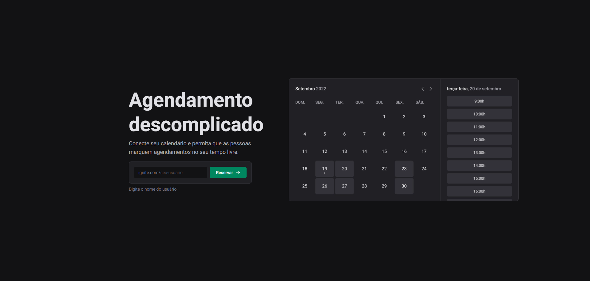
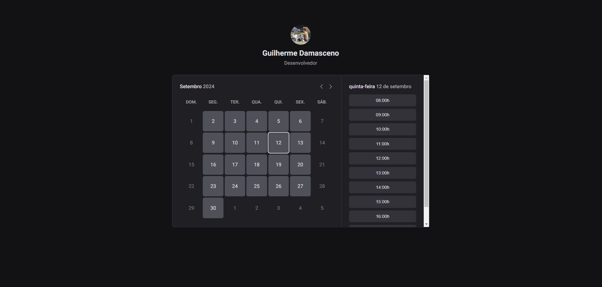
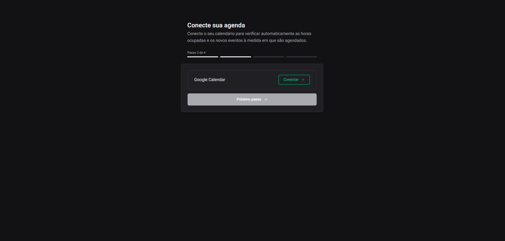
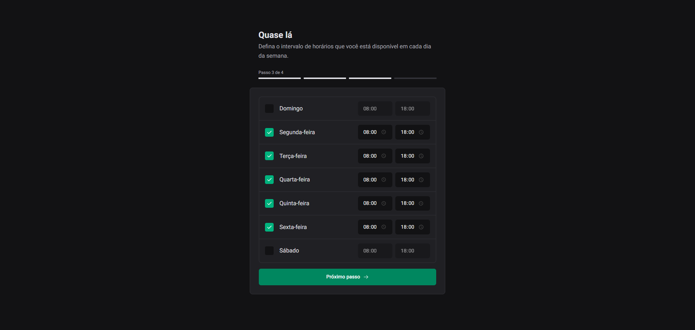

<h1 style="text-align: center;">
  Ignite Call
</h1>

<p align="center">
  <a href="#project">Projeto</a>&nbsp;&nbsp;&nbsp;|&nbsp;&nbsp;&nbsp;
  <a href="#technologies">Tecnologias</a>&nbsp;&nbsp;&nbsp;|&nbsp;&nbsp;&nbsp;
  <a href="#pages">Páginas</a>&nbsp;&nbsp;&nbsp;|&nbsp;&nbsp;&nbsp;
  <a href="#usage">Utilização</a>
</p>

<h2 id='project'>Projeto</h2>

O projeto Ignite Call é uma aplicação de agendamento inovadora que simplifica a gestão de compromissos. Uma das características principais da aplicação é a integração com o Google Calendar, garantindo que os usuários possam visualizar e gerenciar seus agendamentos em diferentes plataformas de forma unificada.

O Ignite Call foi desenvolvido utilizando um Design System personalizado, que assegura uma interface consistente e intuitiva, aprimorando a experiência do usuário. O front-end da aplicação é construído com o framework Next.js, que oferece desempenho otimizado e capacidades avançadas de renderização. Para a interação com o banco de dados, utilizamos o ORM Prisma, que facilita a manipulação de dados com segurança, eficiência e inclui validações robustas.

A aplicação é especialmente voltada para a criação de eventos personalizados no calendário do usuário. Os usuários podem cadastrar sua disponibilidade em dias e horas específicos e compartilhar essa informação com outras pessoas, permitindo que elas reservem horários de acordo com a conveniência mútua. Isso torna o Ignite Call uma ferramenta poderosa para profissionais que necessitam de uma gestão eficaz e integrada de seus compromissos.

<h2 id="technologies">Tecnologias</h2>

Este projeto foi desenvolvido com as seguintes tecnologias:

- [Axios](https://www.npmjs.com/package/axios)
- [ReactJs](https://reactjs.org)
- [React Query](https://tanstack.com/query/latest/docs/framework/react/overview)
- [React Hook Form](https://react-hook-form.com/)
- [NextJS](https://nextjs.org/)
- [Next Auth](https://next-auth.js.org/)
- [Next SEO](https://github.com/garmeeh/next-seo)
- [TypeScript](https://www.typescriptlang.org/)
- [Stitches](https://stitches.dev/)
- [Phosphor-icons](https://phosphoricons.com/)
- [dayjs](https://day.js.org/)
- [Prisma](https://www.prisma.io/?via=start&gad_source=1)
- [PostgreSQL](https://www.postgresql.org/)
- [Nookies](https://www.npmjs.com/package/nookies)
- [Google APIS](https://developers.google.com/apis-explorer?hl=pt-br)
- [Zod](https://zod.dev/)

<h2 id='pages'> Layout</h2>









<h2 id="usage">Executando o Front-end</h2>

```bash
# Clone o projeto para o local desejado em seu computador.
$ https://github.com/GuiiDamasceno/Ignite-Call.git

# Acesse a pasta do projeto:
$ cd ignite-call

# Instale as dependências:
$ npm install

# Inicie o servidor:
$ npm run dev

```

---

  <p align="center">
    Desenvolvido por: Guilherme Damasceno
  </p>

  [](https://www.linkedin.com/in/guilherme-damasceno-1b703a286/)
